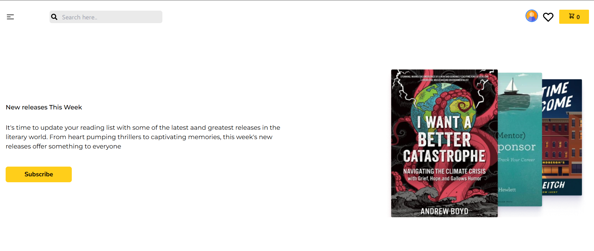
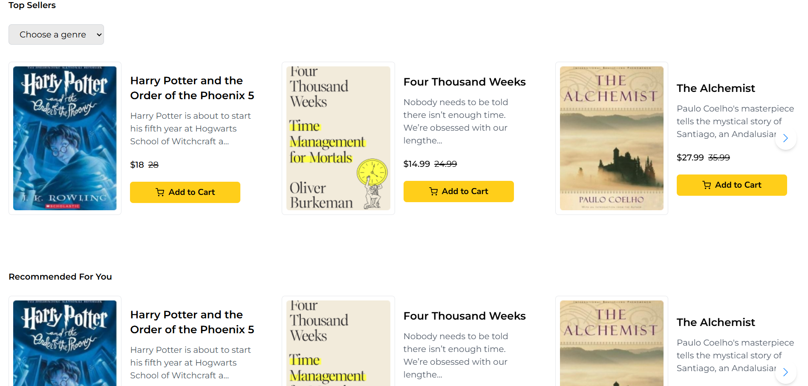
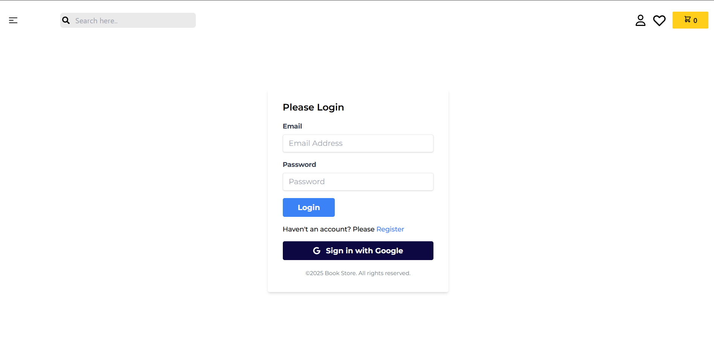
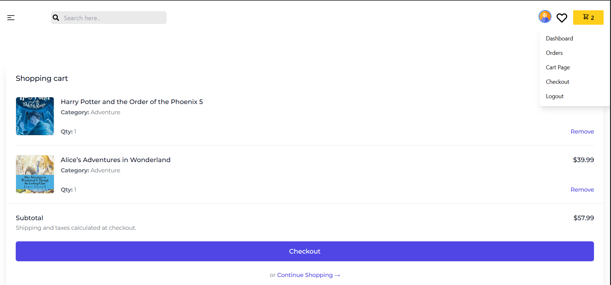
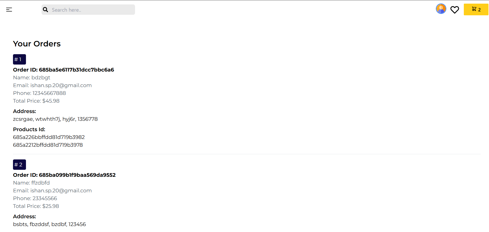
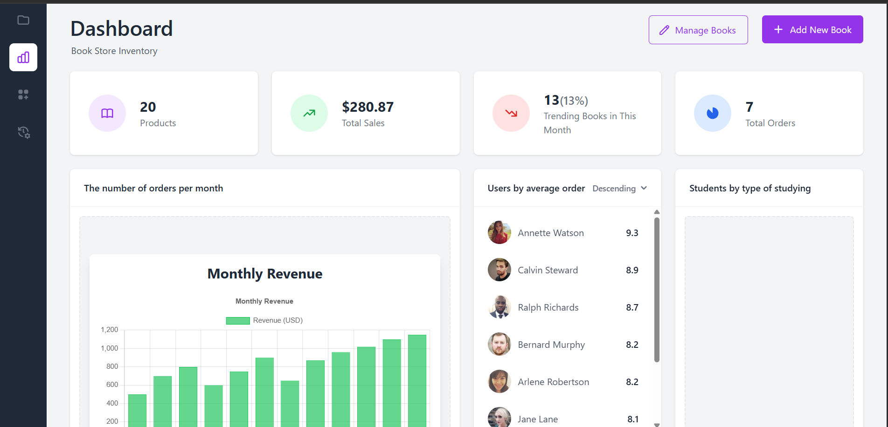
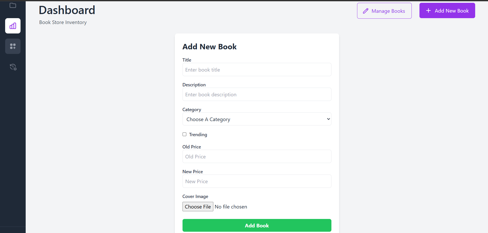
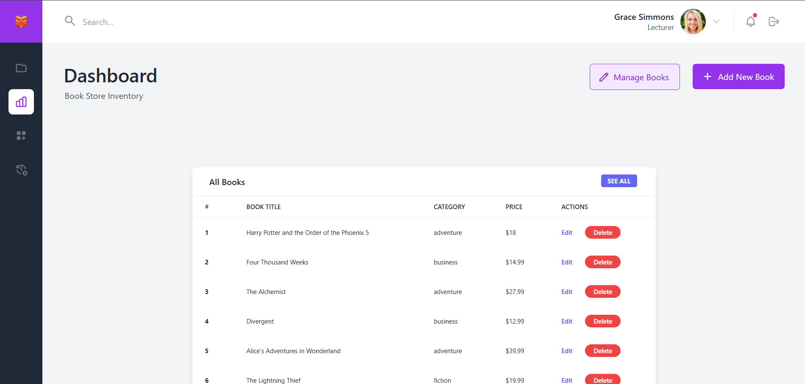

# 📚 Page&Pen -> A Full-Stack Book Store (MERN Stack)

### A feature-rich full-stack Book Store application built with the **MERN stack (MongoDB, Express.js, React, Node.js)**. This platform supports both **user and admin functionalities**, including secure login, book browsing, order processing, and complete admin management.

---

## 🚀 Features

### 🛒 Customer Features
- 📖 Browse all available books
- 🔍 Filter by categories (Fiction, Horror, Business, etc.)
- 🔝 View Top-Selling Books
- 📰 Latest Book News section
- 🧾 Checkout with cart preview
- 🔐 Login system with secure token authentication
- 📦 View order history with invoice

### ⚙️ Admin Features
- 📚 Add new books to inventory
- ✏️ Edit or update existing book details
- ❌ Delete books from store
- 🗃️ View all orders placed by customers
- 🎛️ Admin dashboard with real-time book management

---

## 🧰 Tech Stack

| Frontend       | Backend        | Database    | Authentication | Styling       |
|----------------|----------------|-------------|----------------|----------------|
| React.js       | Node.js        | MongoDB     | JWT (Token)    | Tailwind CSS   |
| Redux Toolkit  | Express.js     | Mongoose    | Cookies + Token| SweetAlert2    |

---

## 🖼️ Screenshots

  
  
  

 

  
  
  

 

  
  
  

---
